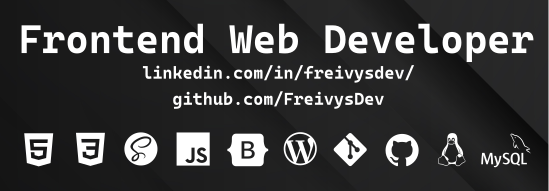

# Hi, I'm **Freivys Paredes**.

## **Frontend Developer**

**Venezuelan** by blood and heart, living in **Chile**.

### [Link a mi perfil de GitHub](https://github.com/FreivysDev)

# A little more about me..

Hi, I'm Freivys. I'm currently studying to be a Full Stack Developer. I am passionate about programming and web development since I was young. I have experience in the area of computer support, HW, SW, Printers, cabling and networking. Among my skills are; teamwork, proactivity, creativity, good interpersonal relationships and responsibility.

# Tech Stack:


# Comandos utiles para usar en la Terminal

| Command | Description                                     | Example             |
| ------- | ----------------------------------------------- | ------------------- |
| ls      | lista los archivos y carpetas                   | ls -l               |
| pwd     | muestra la ruta actual donde estas              | pwd                 |
| mkdir   | permite crear una carpeta                       | mkdir nombreCarpeta |
| touch   | permite crear un archivo                        | touch README.md     |
| cat     | permite visualizar la información de un archivo | cat README.md       |
| alias   | permite crear alias                             | alias l="clear"     |

# Comandos alias utiles que puedes crear para utilizar en la Terminal

Para crear tu alias debe conocer primero que SHELL tienes por defecto en la terminal, para ello
utilizaremos el siguiente comando:

```bash
echo $SHELL
```

Dependiendo de la terminal que estes usando tenemos que ejecutar algunos de estos comandos:

| SHELL         | Comando                         |
| ------------- | ------------------------------- |
| /usr/bin/bash | nano ~/.bashrc                  |
| /usr/bin/zsh  | nano ~/.zshrc                   |
| /bin/fish     | nano ~/.config/fish/config.fish |

## Tabla comandos alias utiles para GNU Linux:

| Comando                                                          | Descripción                                                                    |
| ---------------------------------------------------------------- | ------------------------------------------------------------------------------ |
| alias actualizar="sudo aptitude update && sudo aptitude upgrade" | Alias que permite realizar la actualización de programas y paquetes instalados |
| alias limpiar="sudo aptitude clean && sudo aptitude autoclean"   | Alias que permite hacer mantenimiento a programas y paquetes instalados        |
